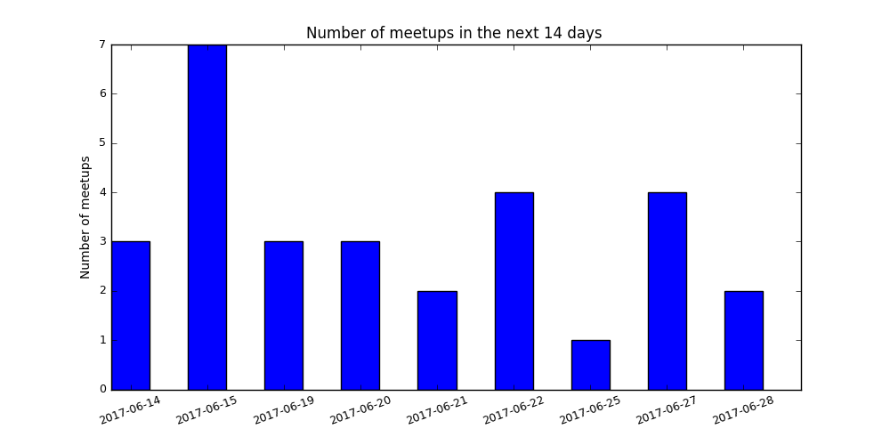
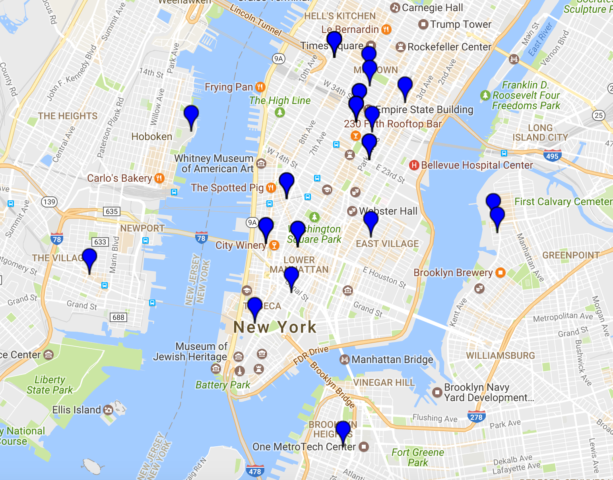
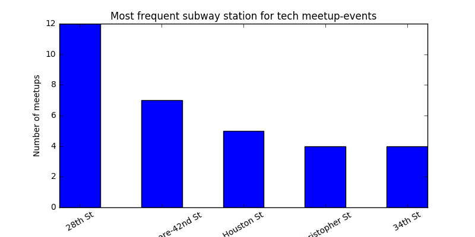
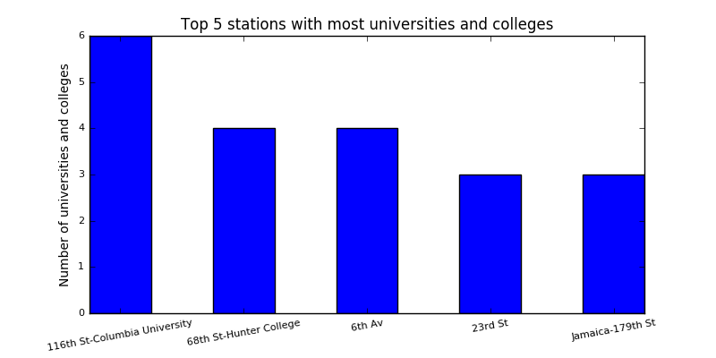
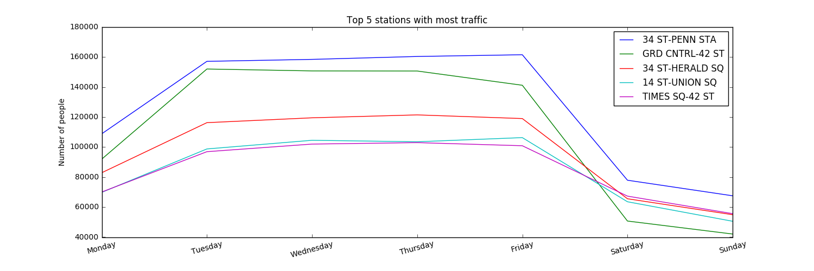
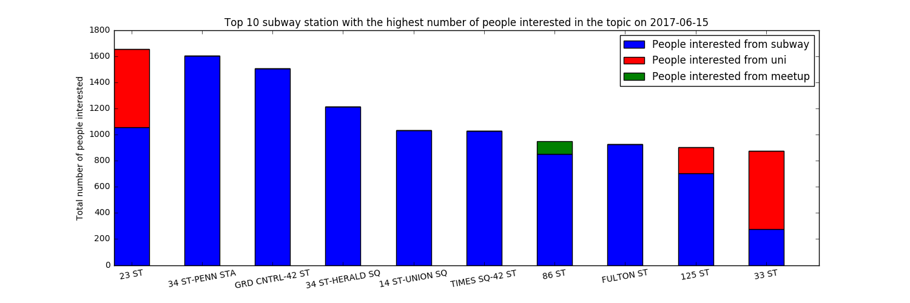
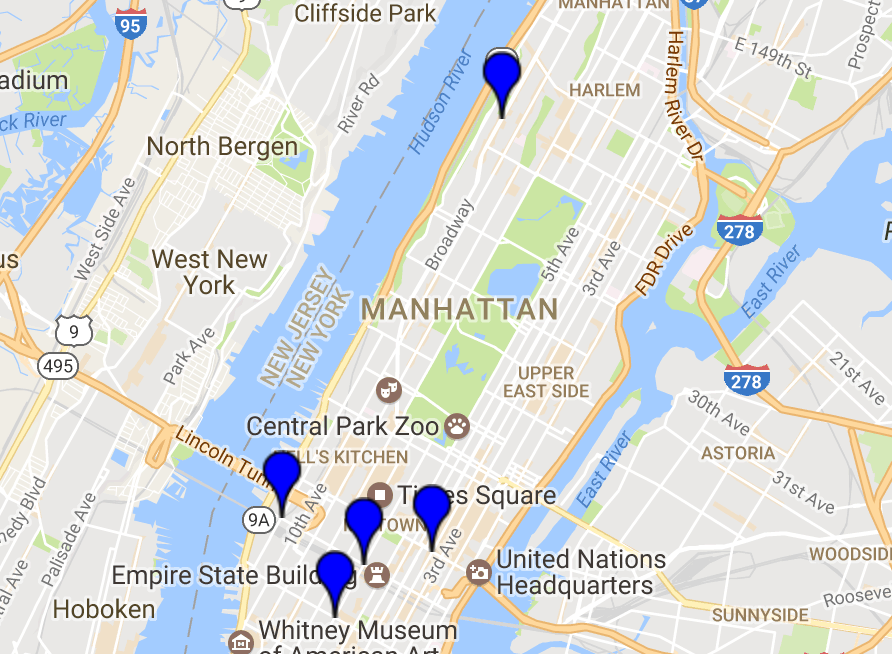

# K2_Project1

# First Project - Finding best areas to canvas

__EXERCISE__

A non-profit organization is trying to raise awareness about women in technology. They want you to identify the best areas to canvas during the day. They want to place teams at the entrances to various subway stations. At which stations would they be the most successful?

__APPROACH__

The aim was to estimate the number of people, who would be interested in the topic, at each subway station. As a result,the stations with the highest estimation are supposed to be the best spots to canvas.

Different aspects were considered to estimate the number of people, who would be interested in the topic. These aspects were brought together based on assumptions. I based my modell on the following factors:
- if there is a meetup close to the station at a specific day, it will positively influence the estimation
- if there is a university close to the station, it more likely that people are interested in the topic
- the number of people at each subway station has an impact on the estimation

__ASSUMPTIONS__

- The number of people using the subway is constant for each weekday (that means, the number of people using the subway next Monday is the same as last Monday)
- Only 1% of the random people are interested in the topic "Woman in technology"
- If there is a university in the neighborhood, the number of people interested in the topic should be increased by 200 person (Refinement of the method: the number could be based on the number of stundents studying at the university, e.g. 15% of all enrollments). Universities have a influence only from Monday to Friday.
- If there is a meetup on the specific day, the number of people interested in the topic should be increased by 100 person (Refinement of the method: the number could be based on the participants of the meetup, e.g. 90%).

__USED DATASETS__

- Tech meetups in NYC (www.meetup.com with filter "tech" within 5 miles from New York) - web scraping
- NY Subway Station with coordinates from data.ny.gov (https://data.ny.gov/Transportation/NYC-Transit-Subway-Entrance-And-Exit-Data/i9wp-a4ja
- Turnstile data from Metropolitan Transportation Authority (http://web.mta.info/developers/turnstile.html)
- Location of universities in New York from NYC OpenData (https://data.cityofnewyork.us/Education/Colleges-and-Universities/4kym-4xw5)

__EXPLANATION__

1. Aspect - meetups

At first I scraped the webpage of meetup.com to identify all tech groups within 5 miles of New York. All the events of each of these tech groups were imported in a dataset (df_groups). Events with missing location or date were deleted from the dataset.

On the following graph you can see the distribution of the number of meetups in the following 2 weeks.

The coordinates of each addresses in the dataset were assigned by means of the GoogleMaps library.

With the help of the NY Subway station coordinates from data.ny.gov, the closest subway station to each event was calculated. The closest subway station had the smallest Euclidean distance with the coordinates of the meetup-event. In case a subway station had more entrances, only the coordinates of the first entrance was used.

The graph below shows the most frequent subway stations for tech meetups in the next 2 weeks.

2. Aspect - universities

I imported the coordinates of each universities from the NYC OpenData website. I used the same procedure as by the meetups to define the closest station to each university.

The graph below shows the top 5 most popular subway stations around the universities and colleges in New York.

3. Aspect - Foot traffic in NYC subway

By means of the turnstile data for each metro station, the average number of people using the metro was defined for each weekday. The total entries and exits were added together and divided by two, to get the number of people using the subway. (I used a dataset of 2 weeks, and took the average of the total number, to have a more stable estimation of people using the subway.)

The following picture shows the top 5 subway stations with the highest traffic on each weekday.

Due to the inconsistent station names I had to clean the dataset. (e.g. all the street names with a number were written differently: 28TH STREET vs. 28 STREET).

After preparing the support-datasets, I constructed a new dataset for the estimation: the dates of the next 2 weeks were mixed with the subway station names (as a cartesian product). For each record, the following informations were assigned:
- number of people using the subway (nr_people)
- number of meetups nearby (nr_meetup)
- number of universities nearby (nr_university)

The expected number of people, who are interested in the topic can be calculated as following:
- for each station, the expected number is 1 % of the total number of people using the subway
- for each station and day, the expected number should be increased by 100 per meetup
- for each station, the expected number should be increased by 200 per university on weekdays

`expected_nr= nr_people 1% + nr_meetups 100 (on days of meetups)+ nr_university * 200 (only on workdays)`

The top 10 station with the highest number of people interested in the topic for date 15/06/2017 can be seen in the following graph:

Let's say, that we have only five teams to canvas. The following map shows the location of the top 5 subway stations.

__Refinement of the modell__

- instead of having the same assumptions by different universities, the number of enrolled students could be taken into considerartion (with a fix precentage of interested students) to estimate the expected number. By meetups, the number of participants times a percentage could be used for the same purpose.
- the location of startups could be also taken into consideration
- the analysis could be done by also dealing with the time of the day (and not only the dates)
- we could also consider the seasonality in our modell
