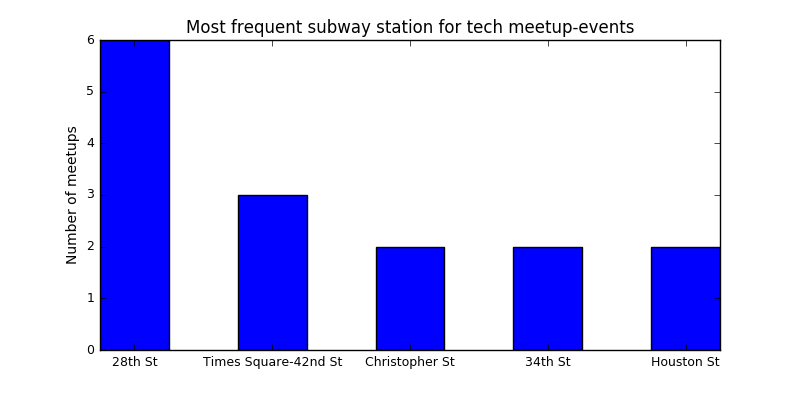

# K2_Project1

# First Project - Finding best areas to canvas

__EXERCISE__

A non-profit organization is trying to raise awareness about women in technology. They want you to identify the best areas to canvas during the day. They want to place teams at the entrancesto various subway stations. At which stations do they have the most success?

__APPROACH__

The aim was to estimate at each subway station for each day the number of people, who would be interested in the topic. As a result,the stations with the highest estimation are supposed to be the best spot to canvas.

Different aspects were considered to estimate the number of people, who would be interested in the topic. These aspects were brought together based on assumptions.
- if there is a meetup close to the station at a specific day
- if there is a university close to the station
- number of people at each subway station

__ASSUMPTIONS__

The number of people using the subway is constant for each weekday (that means, the number of people using the subway next Monday is the same as last Monday)

- Only 1% of the random people are interested in the topic "Woman in technology"
- If there is a university, the number of people interested in the topic should be increased by 200 person (Refinement of the method: the number should be based on the enrollment of the university, e.g. 15% of all enrollments). Universities have a influence only from Monday to Friday.
- If there is a meetup on the specific day, the number of people interested in the topic should be increased by 100 person (Refinement of the method: the number should be based on the participants of the meetup, e.g. 90%).

__USED DATASETS__

- Tech meetups in NYC (www.meetup.com with filter "tech" within 5 miles from New York) - web scraping
- NY Subway Station with coordinates from data.ny.gov (https://data.ny.gov/Transportation/NYC-Transit-Subway-Entrance-And-Exit-Data/i9wp-a4ja
- Turnstile data from Metropolitan Transportation Authority (http://web.mta.info/developers/turnstile.html)
- Location of universities in New York from NYC OpenData (https://data.cityofnewyork.us/Education/Colleges-and-Universities/4kym-4xw5)

__EXPLANATION__

1. Aspect - meetups

At first the webpage of meetup.com were scraped to identify all tech groups within 5 miles of New York. All the events of each of these tech groups were imported in a dataset (df_groups). Events with missing location or date were deleted from the dataset.

The coordinates of each addresses in the dataset were assigned by means of GoogleMaps library (needed an API Key).

By means of the NY Subway station coordinates from data.ny.gov, the closest subway station to each event was calculated. The closest subway station had the smallest Euclidean distance with the coordinates of the meetup-event. In case a subway station had more entrances, only the coordinates of the first entrance was used. (It would be possible to check all the coordinates, but because of performance reasons the dataset was filtered.

2. Aspect - universities

A similar procedure was used as by the meetups. By means of the data about the location of universities, the coordinates of each universities was imported in a dataset. With the same procedure as by the meetups, to each university the closest station was defined.

3. Aspect - Foot traffic in NYC subway

By means of the turnstile data for each metro station, the average number of people using the metro was defined for each weekday. The total entries and exits were added together and divided by two, to get the number of people using the subway. (I used a dataset of 2 weeks, and took the average of the total number, to have a more stabil estimation of people using the subway.)
Merging the datasets

The source of two datasets containing the turnstile data and the geocodes of the subway stations were different, that's why there were couple of station names, which were different. (e.g. all the streetnames with a number were written differently: 28TH STREET vs. 28 STREET). By means of a dictionary the two datasets were harmonized.

After all the support-datasets were prepared, a new dataset was constructed: The dates of the next 2 weeks were mixed with the subway station (as a cartesian product). For each record, the corresponding data of the support datasets were assigned:
1. number of people using the subway (nr_people)
2. number of meetups nearby (nr_meetup)
3. number of universities nearby (nr_university)

The expected number of people, who are interested in the topic can be calculated as following:
1. for each station, the expected number is 1 % of the total number of people using the subway
2. for each station and day, the expected number should be increased by 100 per meetup
3. for each station, the expected number should be increased by 200 per university on weekdays

expected_nr= nr_people 1% + nr_meetups 100 (on days of meetups)+ nr_university * 200 (only on workdays)

The top 10 station with the highest number of people interested in the topic for date 14/06/2017 can be seen in the following graph:

Let's say, that we have only five team to canvas. The following map shows the location of the top 5 subway stations.

__Refinement of the modell__

- instead of having the same assumptions by different universities, the number of enrolled students could be taken into considerartion (with a fix precentage of interested students) to estimate the expected number. By meetups, the number of participants times a percentage could be used for the same purpose.
- the location of startups could be also taken into consideration
- the analysis could be done by also dealing with the times (and not only the dates)
